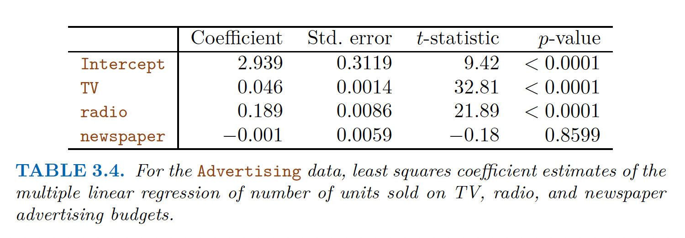

# question 2.1

> For each of parts (a) through (d), indicate whether we would generally expect
> the performance of a flexible statistical learning method to be better or
> worse than an inflexible method. Justify your answer.
>
> a. The sample size $n$ is extremely large, and the number of predictors $p$ is
>    small.
> b. The number of predictors $p$ is extremely large, and the number of
>    observations $n$ is small.
> c. The relationship between the predictors and response is highly
>    non-linear.
> d. The variance of the error terms, i.e. $\sigma^2 = Var(\epsilon)$, is
>    extremely high.\

## **answer:**
This question is about the bias-variance trade-off. 
Denoted as $$E[(Y- \hat{f}(x))^2|X=x_0]=\sigma^2_\varepsilon+\text{Bias}^2[\hat{f}(x_0)]+\text{Var}[\hat{f}(x_0)]$$
A flexible method is expected to perform with higher variance but lower bias, 
while an inflexible method is expected to perform with lower variance but higher bias.
Our target is to minimize the test error, hence we want to balance the bias and variance.\

1. **Flexible method is expected to be better.**
   when the sample size $n$ is large, the data is complicated, and the 
   flexible method can capture the complexity of the data and fit well, since 
   small changes in the data would not greatly affect the whole dataset, so the error due to variance is low,
   which may hard to lead to overfitting.
   Meanwhile, since the number of predictors $p$ is small, 
   the computational cost of using a more flexible method would not be a big issue,
   so the flexible method is expected to be better.

2. **Inflexible method is expected to be better.**
   Opposite to the situation in part (a),
   having a large number of predictors makes flexible methods more computationally costly.
   At the same time, the small number of $n$ means that small changes in the data could result in large changes in $f$,
   which may lead to high variance and overfitting.
   Therefore, in order to reduce the computational cost and also reduce the potential for error due to variance, 
   inflexible method is expected to be better.

3. **Flexible method is expected to be better.**
   Since the relationship between the predictors and response is highly non-linear,
   a flexible method would be able to capture and fit to the non-linearity and reduce the bias, 
   and error introduced by approximating a real-life problem. If we choose inflexible method,
   it would be more likely to underfit the data becuase of its non-linearity, and the error introduced by bias would be higher than the variance
   which leads to higher test error.

4. **Inflexible method is expected to be better.**
   Under the given information, we cannot determine whether the bias is high or low, however, since
   the variance is extremely high, we assume the variance is far more higher than the bias (and perhaps it's low),
   a more flexible model will fit the noise and lead to a much more higher variance, and finally turn out to be overfitting,
   hence, we expected to first use the inflexible method to obtain the balance of variance and biase, and then do the further analysis and obtain more information. 

# question 2.3

> We now revisit the bias-variance decomposition.
> 
> (a) Provide a sketch of typical (squared) bias, variance, training error,
> test error, and Bayes (or irreducible) error curves, on a single
> plot, as we go from less flexible statistical learning methods
> towards more flexible approaches. The x-axis should represent
> the amount of flexibility in the method, and the y-axis should
> represent the values for each curve. There should be five curves.
> Make sure to label each one.
> 
> (b) Explain why each of the five curves has the shape displayed in
> part (a).\

## **answer:**
\
(a).
\

{width=80%}

\
(b). Here's an explanation for the shape of each of the five curves:

1. **Bias**: The bias curve shows a monotonic decrease as model flexibility increases. This is because more flexible models can better capture complex relationships in the data, reducing the gap between model assumptions and actual data patterns. For example, as we move from linear regression to decision trees to ensemble methods, the model makes fewer assumptions, thus lowering bias.
2. **Variance**: The variance curve monotonically increases with model flexibility. This occurs because more flexible models are more susceptible to fitting noise in the training data, leading to overfitting. For instance, in K-nearest neighbors, as K decreases, the model becomes more flexible but also more sensitive to individual data points, thereby increasing variance.
3. **Training Error**: The training error curve monotonically decreases as model flexibility increases. This is because more flexible models can fit the training data better, potentially even perfectly fitting all training points. For example, a decision tree with as many leaf nodes as there are training samples can achieve zero training error, though this often indicates overfitting.
4. **Test Error**: The test error curve has a U-shape. When model flexibility is low, test error is high due to high bias (underfitting). As flexibility increases, test error decreases until it reaches an optimal point. Beyond this point, as the model becomes too flexible, variance increases leading to overfitting, and test error starts to rise again. The optimal point represents the best balance between bias and variance.
5. **Irreducible Error**: The irreducible error is a horizontal line that doesn't change with model flexibility. This error stems from inherent noise or randomness in the data that can't be reduced by improving the model. It represents the lower bound of error that persists even with an ideal model.

# question 3.1
> Describe the null hypotheses to which the p-values given in Table 3.4 correspond. 
> Explain what conclusions you can draw based on these p-values. Your explanation should be phrased in terms of sales, TV,
> radio, and newspaper, rather than in terms of the coefficients of the
> linear model.

{width=80%}

## **answer:**
In Table 3.4, the p-values correspond to the null hypotheses that each advertising medium—TV, radio, and newspaper—has no effect on sales, 
meaning that their true coefficients are zero. \
For TV and radio, the p-values are extremely small (both less than 0.0001), indicating that we can **reject the null hypotheses** for these variables. 
This suggests that both TV and radio advertising have a statistically significant positive impact on sales. \
In contrast, the p-value for newspaper advertising is quite large (0.8599), meaning we **fail to reject the null hypothesis** for newspaper. \
Thus, there is no evidence that newspaper advertising has a significant effect on sales in this model. \
Therefore, we can conclude that TV and radio spending are important predictors for increasing sales, while newspaper spending likely does not contribute meaningfully to sales.

# question 3.5

> Consider the fitted values that result from performing linear regression
> without an intercept. In this setting, the ith fitted value takes
> the form
> $$\hat y_i = x_i\hat \beta$$
> where $$\hat \beta = (\sum_{i=1}^n x_iy_i)/ \sum_{i=1}^n x_{i'}^2.$$
> show that we can write 
> $$\hat y_i = \sum_{i'=1}^n a_{i'}y_i.$$
> what is $a_i$?
> Note: We interpret this result by saying that the fitted values fromlinear regression are linear combinations of the response values.

## **answer:**

To show that the fitted values $\hat{y}_i$ from a linear regression without an intercept can be expressed as a linear combination of the response values $y_i$, we start with the given form of the fitted value:

$$\hat{y}_i = x_i \hat{\beta}$$
where
$$
\hat{\beta} = \frac{\sum_{i=1}^n x_i y_i}{\sum_{i=1}^n x_i^2}.
$$
$$
\hat{y}_i = x_i \left( \frac{\sum_{i'=1}^n x_{i'} y_{i'}}{\sum_{i'=1}^n x_{i'}^2} \right).
$$
$$
\hat{y}_i = \frac{x_i}{\sum_{i'=1}^n x_{i'}^2} \sum_{i'=1}^n x_{i'} y_{i'}.
$$
$$
\hat y_i = \sum_{i'=1}^n \left( \frac{x_i x_{i'}}{\sum_{i'=1}^n x_{i'}^2} \right) y_{i'}.
$$

Thus, the fitted value $\hat y_i$ is a linear combination of the response values $y_{i'}$, where the coefficient $a_{i'}$ associated with each $y_{i'}$ is:

$$
a_{i'} = \frac{x_i x_{i'}}{\sum_{i'=1}^n x_{i'}^2}.
$$