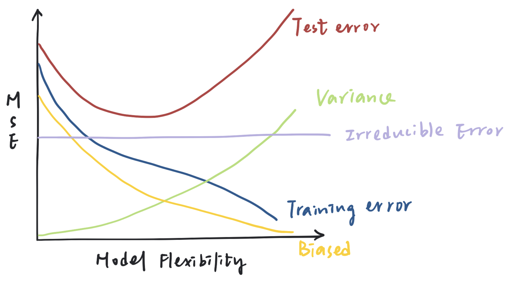

# question 2.1

> For each of parts (a) through (d), indicate whether we would generally expect
> the performance of a flexible statistical learning method to be better or
> worse than an inflexible method. Justify your answer.
>
> a. The sample size $n$ is extremely large, and the number of predictors $p$ is
>    small.
> b. The number of predictors $p$ is extremely large, and the number of
>    observations $n$ is small.
> c. The relationship between the predictors and response is highly
>    non-linear.
> d. The variance of the error terms, i.e. $\sigma^2 = Var(\epsilon)$, is
>    extremely high.\

## **answer:**
This question is about the bias-variance trade-off. 
Denoted as $$E[(Y- \hat{f}(x))^2|X=x_0]=\sigma^2_\varepsilon+\text{Bias}^2[\hat{f}(x_0)]+\text{Var}[\hat{f}(x_0)]$$
A flexible method is expected to perform with higher variance but lower bias, 
while an inflexible method is expected to perform with lower variance but higher bias.
Our target is to minimize the test error, hence we want to balance the bias and variance.\

1. **Flexible method is expected to be better.**
   when the sample size $n$ is large, the data is complicated, and the 
   flexible method can capture the complexity of the data and fit well, since 
   small changes in the data would not greatly affect the whole dataset, so the error due to variance is low,
   which may hard to lead to overfitting.
   Meanwhile, since the number of predictors $p$ is small, 
   the computational cost of using a more flexible method would not be a big issue,
   so the flexible method is expected to be better.

2. **Inflexible method is expected to be better.**
   Opposite to the situation in part (a),
   having a large number of predictors makes flexible methods more computationally costly.
   At the same time, the small number of $n$ means that small changes in the data could result in large changes in $f$,
   which may lead to high variance and overfitting.
   Therefore, in order to reduce the computational cost and also reduce the potential for error due to variance, 
   inflexible method is expected to be better.

3. **Flexible method is expected to be better.**
   Since the relationship between the predictors and response is highly non-linear,
   a flexible method would be able to capture and fit to the non-linearity and reduce the bias, 
   and error introduced by approximating a real-life problem. If we choose inflexible method,
   it would be more likely to underfit the data becuase of its non-linearity, and the error introduced by bias would be higher than the variance
   which leads to higher test error.

4. **Inflexible method is expected to be better.**
   Under the given information, we cannot determine whether the bias is high or low, however, since
   the variance is extremely high, we assume the variance is far more higher than the bias (and perhaps it's low),
   a more flexible model will fit the noise and lead to a much more higher variance, and finally turn out to be overfitting,
   hence, we expected to first use the inflexible method to obtain the balance of variance and biase, and then do the further analysis and obtain more information. 

# question 2.3

> We now revisit the bias-variance decomposition.
> 
> (a) Provide a sketch of typical (squared) bias, variance, training error,
> test error, and Bayes (or irreducible) error curves, on a single
> plot, as we go from less flexible statistical learning methods
> towards more flexible approaches. The x-axis should represent
> the amount of flexibility in the method, and the y-axis should
> represent the values for each curve. There should be five curves.
> Make sure to label each one.
> 
> (b) Explain why each of the five curves has the shape displayed in
> part (a).\

## **answer:**
\
(a).
\

{width=80%}

\
(b).

这是您请求的英文版本：

- **Bias**: is the error introduced when the complexity of a problem is not sufficiently modelled by the simplicity of the chosen method 
(e.g. linear regression for non-linear relationships). As model flexibility increases (linear->trees->boosting, decreasing K in KNN, etc.), bias decreases monotonically, because less assumptions are being made about the data structure and its relationship with the response.
- **Variance**: refers to how much model predictions would change with different training data. It increases with model flexibility because more complex models tend to fit the training data too closely, leading to overfitting and poor generalization on new data.
- **Training Error**: decreases monotonically as flexibility increases. More flexible methods are generally higher variance, and can learn more complex relationships more completely, but also run the risk of overfitting, which is seen where the training error and test error diverge. Think of a decision tree, where the number of terminal nodes = the number of training observations (this model will have 0 training error and a high test error).
- **Test Error**: it first declines, then flattens, and finally begins to rise as model flexibility increases. The lowest point on this curve represents the optimal trade-off between bias and variance, where the total error ($E[(Y-\hat{Y})^2] = [Bias(\hat{f}(X))]^2 + Var(\hat{f}(X)) + Var(\epsilon)$) is minimized. Beyond this point, the model becomes too specific to the training data, leading to overfitting (high variance with low bias). On the other hand, before reaching this point, the model may be underfitting due to high bias and insufficient flexibility.
- **Irreducible Error**: it stems from the inherent noise/ randomness in the dataset. This type of error remains constant and cannot be reduced, no matter how sophisticated or flexible the model becomes. The reason is that the error term $\epsilon$ might include unmeasured factors or natural variability that cannot be captured by the input variables $X$. Therefore, regardless of how accurately the model approximates the true function $f$, there will always be some minimum level of error, represented by $Var(\epsilon) > 0$.

# question 3.1

# question 3.5